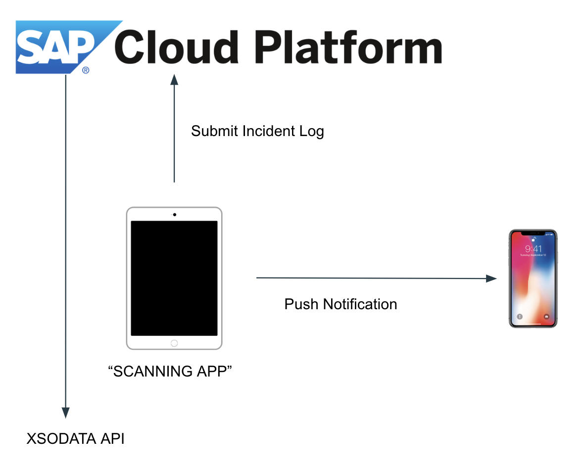

# Scanning Application

 Steps:
 1. Configured device has to be running ios 12.0 or later 
 2. Turn on SAP database on SAP cloud platform
 3. To receive notification, device has to be registered on SAP mobile application.
 
 Architecture:

